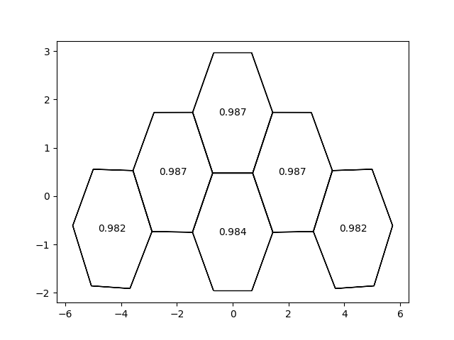

# FindRingsAndAroma
A naive python script to identify rings in systems of atoms, and calculate thier HOMA aromacity.

## Libraries
Python 3.6.9
* numpy 1.18.5
* ase 3.19.1
* matplotlib 3.3.0

## Usage 
```python
import matplotlib.pyplot as plt
import ase.io
import FindRingsAndAroma as rings

Atoms = ase.io.read('sys.xyz')
Rings = rings.Get_rings(Atoms) # find rings in the Atoms system

for x in Rings:
    x.Set_aromHOMA(alpha = 1)
    # x.atom_ind holds the indicies to acces the ring atoms in the Atoms system 
    
rings.PlotRings(Rings, Atoms, inplot='aromHOMA')
plt.show()
```

